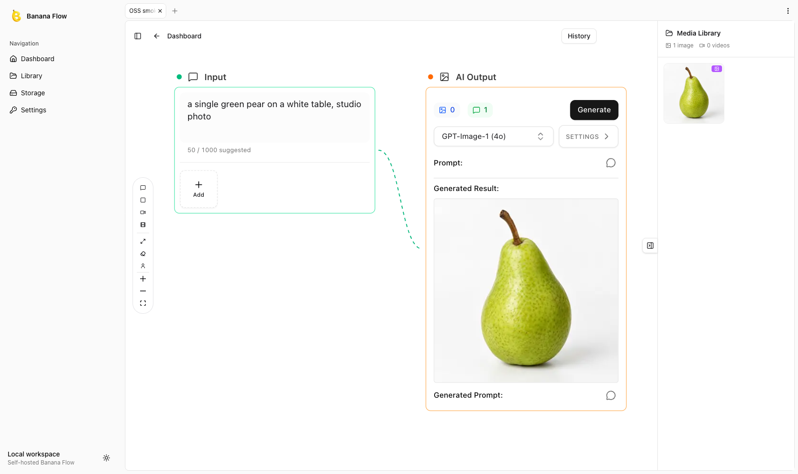

# Banana Flow



Open-source visual canvas for AI image and video generation. Wire prompts, reference images and generation nodes on a board, run them against your own provider key, and keep every result in a local library.

Banana Flow is the engine behind [aibananaflow.com](https://aibananaflow.com). This repository is the self-hostable core: the canvas, the generation pipeline, the run history and the media library. Bring your own OpenAI and Google AI Studio keys; the app calls those providers directly and you pay them, with no credits or plans in between.

## Features

- Node canvas built on React Flow: input nodes (prompt + reference images), image output, video output, seed-frame extraction, upscale, background removal, face consistency.
- Direct provider access with your own keys: GPT Image 1, 1.5, 2 and 2.5 and Sora 2 from OpenAI; Nano Banana, Nano Banana Pro, Nano Banana 2 and Veo 3.1 from Google AI Studio.
- Bulk runs with `{a|b|c}` wildcard prompts, run history with re-run and variations, pinned results, a media library, multi-board tabs.
- Filerobot image editor for cropping, annotating and adjusting inputs before generation.
- Local-disk storage by default, any S3-compatible bucket optionally.
- In-process job scheduler, so a single `yarn dev` or one container is a complete deployment.

## Quick start

Requirements: Node 20+, yarn 1, Docker (for Postgres) or any Postgres 14+.

```bash
git clone https://github.com/maxlibin/bananaflow.git
cd bananaflow
yarn install
cp .env.example .env
# fill APP_SECRET and CRON_SECRET: openssl rand -hex 32
docker compose up -d       # Postgres on localhost:5432
yarn db:migrate
yarn dev
```

Open <http://localhost:3000>, go to **Settings**, paste a Google AI Studio key and/or an OpenAI key, press **Test key**, then **Save**. Create a board from the dashboard and generate.

## Configuration

All settings are environment variables. `.env.example` documents every one; the important ones:

| Variable | Purpose |
|---|---|
| `DATABASE_URL` | Postgres connection string. |
| `APP_ORIGIN` | The origin users reach the app on. Local-disk storage builds asset URLs from it. |
| `APP_SECRET` | Encrypts provider keys at rest (AES-256-GCM). Rotating it invalidates saved keys. |
| `GOOGLE_API_KEY`, `OPENAI_API_KEY` | Optional server-wide provider keys, used when no key is saved in Settings. |
| `ENABLE_INPROCESS_SCHEDULER` | `true` runs the job pollers and bulk queue inside the server. Set `false` to drive `/api/cron/*` from an external scheduler with `CRON_SECRET`. |
| `PUBLIC_BASE_URL` | Optional public origin, only relevant for providers that deliver results by webhook. Leave it empty; the scheduler polls OpenAI and Google. |
| `S3_*` | Optional S3-compatible storage (Cloudflare R2, AWS S3, MinIO). Leave unset for local disk under `./data/uploads`. |

## Reference images

Image-to-image, upscale, background removal, face consistency and image-to-video send your reference image to the provider as bytes, so they work with local-disk storage on plain `localhost`. No public origin or tunnel is needed.

## How it works

- `src/components/flow` is the canvas; `src/stores/board-store.tsx` holds a board's graph and drives generation.
- `src/lib` is the engine: the model registry (`model-registry.ts`), one adapter per provider under `src/lib/providers/` (OpenAI, Google, and Kie.ai for the hosted product), job tables, finalizers, route-handler factories and the scheduler.
- `src/lib/host/types.ts` defines the **host adapter**: auth, provider keys, generation policy, limits, storage, callbacks and the database. `src/host` is the single-user local implementation used by this app. A hosted product plugs in its own (accounts, billing, rate limits) without forking the canvas.
- `src/components/canvas-host/context.tsx` is the client-side counterpart: server actions, cost previews, limit notices and analytics reach the canvas through one React context.

Generation runs through a provider adapter: the API route validates, reserves through the host policy and starts the task. Synchronous providers (OpenAI and Gemini images) return the result in the same request; long-running ones (Veo, Sora) are polled by the scheduler. The finalizer stores the asset and records the media row. See `CLAUDE.md` for the full map.

## Using Banana Flow as a dependency

The package name is `bananaflow`. Another Next.js app can install it from git and import by deep path:

```bash
yarn add bananaflow@github:maxlibin/bananaflow#<commit>
```

```js
// next.config.mjs
export default { transpilePackages: ["bananaflow"] };
```

```css
/* globals.css */
@source "../../node_modules/bananaflow/src";
```

Then build a `HostAdapter` and a `CanvasHost`, bind the route factories in `src/lib/routes/*` to your host, wrap the engine actions in your own `"use server"` file, and render `FlowCanvas` inside `BoardStoreProvider`. `src/host` and `src/app` in this repo are the reference implementation.

## Development

```bash
yarn lint
yarn typecheck
yarn test          # node:test suites under scripts/
yarn db:generate   # after editing src/db/schema.ts
```

## Contributing

Contributions are welcome. By submitting a pull request you agree to the terms in [CLA.md](./CLA.md), which lets the project be relicensed for the hosted version while keeping this repository under the AGPL.

## License

[GNU AGPL v3](./LICENSE). If you run a modified version as a network service, you must offer its source to your users.
